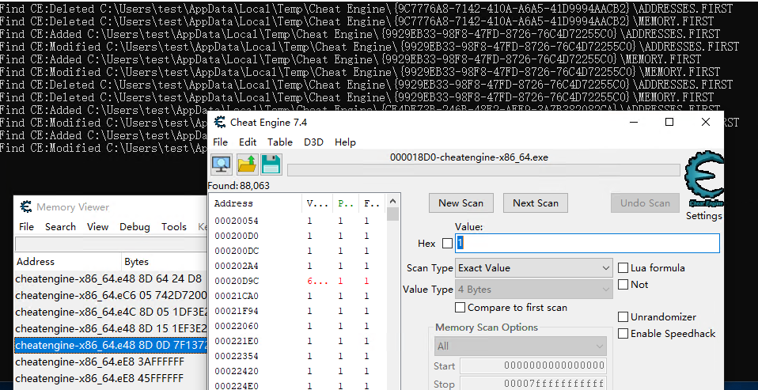

## Detection-CheatEngine



## Principle
[Understanding ReadDirectoryChangesW](
http://qualapps.blogspot.com/2010/05/understanding-readdirectorychangesw.html)

## Expansion
You can add your detection vector easily in [CEInfo.h](https://github.com/gmh5225/Detection-CheatEngine/blob/master/CEInfo.h)
```C++
#pragma once

#define CE_DETECTION_1 L"ADDRESSES.FIRST"
#define CE_DETECTION_2 L"MEMORY.FIRST"
```

## Compile
- Visual Studio 2022
- llvm-msvc [[link]](https://github.com/NewWorldComingSoon/llvm-msvc-build)

## Some discussions on UnknownCheats
https://www.unknowncheats.me/forum/general-programming-and-reversing/502279-using-readdirectorychangesw-detect-cheatengine.html
